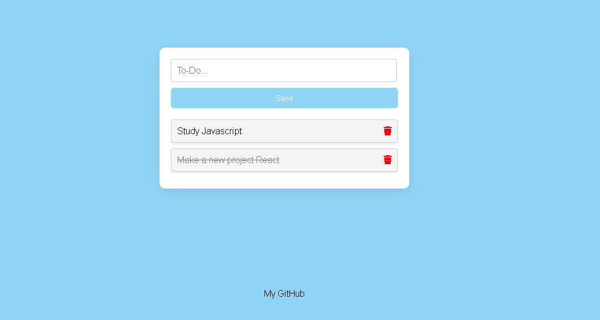

# TodoApp

This is a simple To-Do List project developed using HTML5, CSS3, and JavaScript.

## Features

- Add new tasks by typing text and clicking "Send".
- Remove tasks by clicking the trash icon next to each task.
- Tasks are saved locally in the browser using `localStorage`.

## Technologies Used

- HTML5 
- CSS3 
- JavaScript 

## Demo

## Getting Started

1. Clone or download this repository.
2. Open the `index.html` file in your web browser.

## How to Use

- Type your task in the input field and click "Send" to add it to the list.
- Click the trash icon next to a task to remove it.

## Contributions

Contributions are welcome! If you find any issues or have suggestions for improvements, feel free to open an issue or submit a pull request.

## Author

- GitHub: [My GitHub](https://github.com/Ascenindex)

## License

This project is licensed under the MIT License. See the [LICENSE](LICENSE) file for details.
